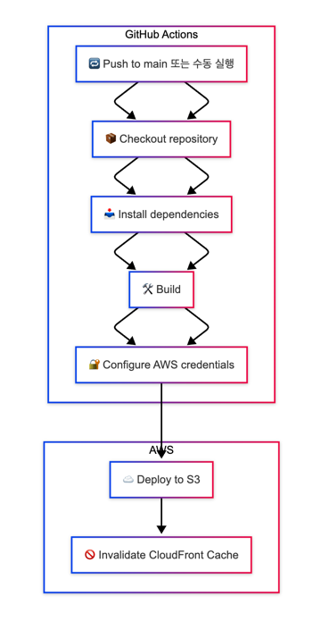

# front_5th_chapter4-1

## 주요 링크

- S3 버킷 웹사이트 엔드포인트: http://frontend-5th.s3-website-ap-southeast-2.amazonaws.com/
- CloudFrount 배포 도메인 이름: https://d11xaxgq148rly.cloudfront.net/

## AWS S3 + CloudFront + GitHub Actions 배포 과정 정리
- Next.js 프로젝트(`out/` 폴더)를 정적 사이트로 빌드하고,
- AWS S3 + CloudFront를 통해 정적 사이트를 배포
- GitHub Actions를 사용해 CI/CD 자동화 구현


### 배포 흐름
1. `main` 브랜치에 푸시 또는 수동 실행 시 워크플로 시작
2. 코드 체크아웃 후 의존성 설치 (`npm ci`)
3. `npm run build`로 정적 파일(`out/`) 생성
4. AWS S3에 `aws s3 sync`로 업로드
5. CloudFront 배포의 캐시 무효화 수행 (이후 새 요청은 S3 오리진으로 요청 => CloudFront 가 응답을 엣지에 새로 캐싱 후 최신 콘텐츠 제공)
   <br><br>
   

### ⚠️ 배포 과정에서 마주한 문제와 해결 방법
1. `Invalid bucket name` – S3 업로드 실패

- **상황**: `aws s3 sync` 명령 실행 시 버킷 이름 형식 오류
- **원인**:
    - Secrets에 등록된 값에 `"arn:aws:s3:::"` 혹은 `s3://` 접두어 포함
    - 또는 마스킹 문자열(`***`)을 그대로 등록함
- **해결 방법**:
    - **순수한 버킷 이름만 등록** (예: `my-app-bucket`)
    - ARN 형식은 CLI 명령어에서는 지원되지 않음
      <br><br><br>
2. `Content-Encoding 누락` – CloudFront 배포 후 응답 헤더에서 압축 정보가 보이지 않음

- **상황**: CloudFront를 통해 배포한 정적 리소스의 응답에서 `Content-Encoding` 헤더가 보이지 않음
- **원인**:
    - 브라우저가 이미 캐시한 리소스를 재요청할 때, CloudFront 엣지 로케이션이 `304 Not Modified` 응답을 반환함
    - `304` 응답은 본문이 없기 때문에, `Content-Encoding`, `Content-Length` 등의 본문 관련 헤더는 **HTTP 표준에 따라 생략**됨
    - 압축은 되어 있어도 헤더가 생략되므로, DevTools에서 이를 확인할 수 없음
- **해결 방법**:
    - 브라우저의 개발자 도구(DevTools) → **Network 탭에서 "Disable cache"** 옵션을 활성화하고 새로고침
    - 강제로 **CloudFront가 200 OK 응답**을 반환하게 하여, 전체 응답 헤더(`Content-Encoding`, `Content-Length` 등)를 다시 확인할 수 있음
      <br><br><br>
3. `AccessDenied` – IAM 사용자로 로그인 시 비용 및 보안 관련 리소스 접근 실패
- **상황**: IAM 사용자로 AWS 콘솔에 로그인한 뒤 아래 API/서비스에 접근 시 모두 `AccessDenied` 오류 발생
- **원인**:
  - 해당 IAM 사용자에게 필요한 권한이 포함된 IAM 정책이 부여되지 않음
  - 일부 서비스(특히 비용 관련 서비스)는 기본적으로 IAM 사용자에게 권한이 없으며, 루트 사용자 또는 명시적으로 권한이 부여된 사용자만 접근 가능
  - `Billing Access`가 IAM 사용자에게 허용되지 않은 경우도 존재
- **해결 방법**:
  - 루트 사용자로 로그인하여 IAM 콘솔에서 **정책 추가 생성**
    ```json 
    "Action": [
             "ce:GetCostAndUsage",
             "ce:GetCostForecast",
             "cost-optimization-hub:ListEnrollmentStatuses",
             "securityhub:DescribeHub",
             "servicecatalog:ListApplications"
           ],

### 추가링크
- [Github Actions 기반 인프라 개념 정리 내용](./aws-cicd-cloudfront-notes.md)
- [CloudFront 적용 전후 성능 비교 보고서](./cloudfront-performance-result.md) 

### 짧은 회고
이미 Cloudfront 기반의 세팅이 되어있는 상태에서 업무했기 때문에, 이런 세팅이 어떻게 되어있는지 더 알아볼 일이 없었고, 어떤 점이 이득인지 잘 몰랐다.<br>
이번에 처음으로 Cloudfront를 적용해보면서, CDN이 정적 리소스의 성능을 크게 향상시킬 수 있다는 것을 실감했다.<br>
특히 TTFB가 크게 감소하고, 전체 로딩 시간이 80% 이상 단축된 점이 인상적이었다. <br>역시 자료를 보는것보단 내 눈으로 보는게 더 큰 인상을 준다.
빨리 개인 프로젝트 만들어서 적용해보고 싶다는 생각이 들었다.<br>
전 직장에서 next/image를 사용할 때 squoosh 를 사용해서 prod에 배포했다가, 이미지가 안나와 이슈가 있었던게 생각났다.<br>
당시 sharp 라이브러리를 활용해서 다시 배포하여 해결했었는데, 이 부분도 다음에 찾아보고, 공부해야겠다는 생각을 했다.<br>
(물론 cdn 적용과는 큰 연관이 없겠지만, 이미지 최적화는 여전히 중요한 부분이니까)<br>
Github workflow도 이번 기회에 하나씩 알아볼 수 있어서 좋았다.<br>
전직장에서는 이미 되어있으니 그냥 넘어갔었던게 아쉽다. 그떄 더 많은 호기심을 가졌더라면 ,,<br> 
아 그리고 마크다운으로 작성하는것도 익숙하지 않았는데, 이번에 연습해볼 수 있어서 좋았다!
